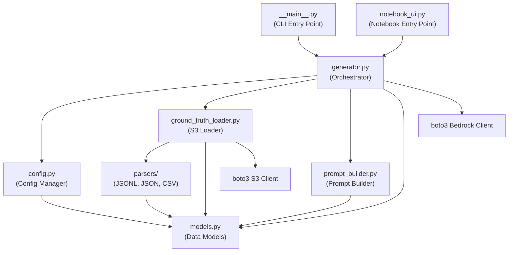
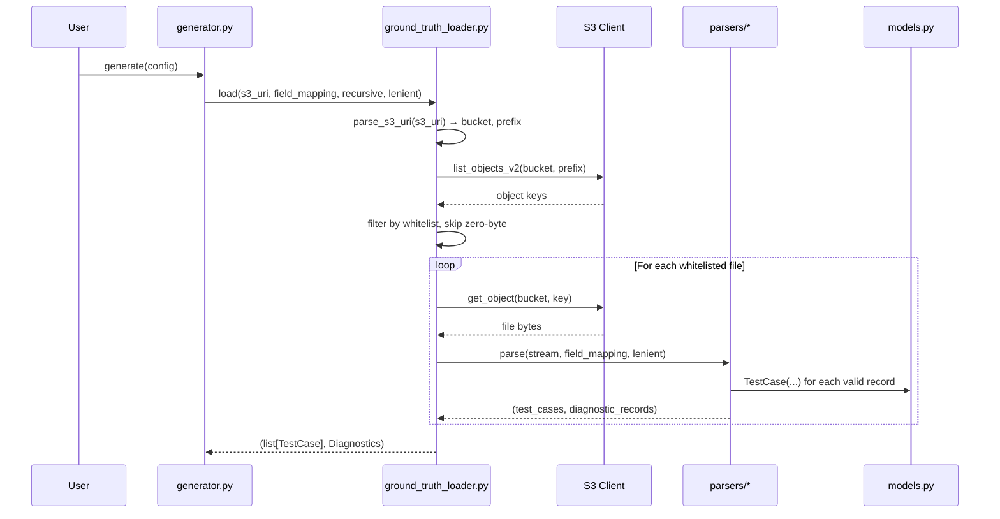
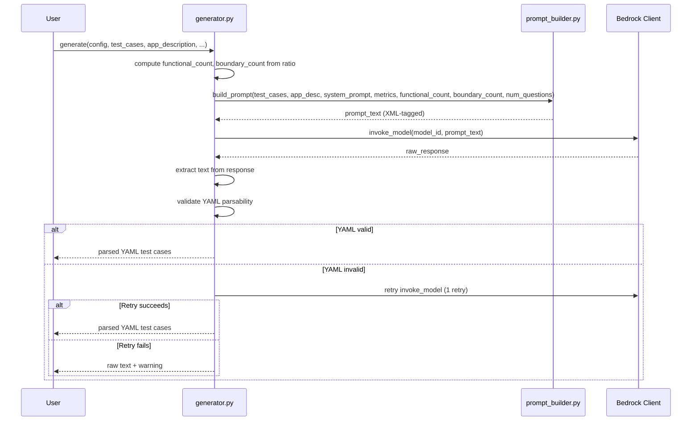

# Design Document: S3 Ground Truth Test Generator

## Overview

This design transforms the existing monolithic `utils.py` / `TestCaseGenerator` class into a modular, testable Python package (`test_generator/`) that supports S3-based ground truth loading, dual-category test generation (functional + boundary), externalized YAML configuration, and both notebook and CLI entry points.

The current system is a single-file prototype that reads local PDFs, constructs a hardcoded prompt, and invokes Bedrock via a notebook UI. The new architecture decomposes this into discrete modules with clear interfaces: an S3 ground truth loader with pluggable parsers, a prompt builder that constructs XML-tagged prompts for frontier models, a config manager, and separate entry points for CLI and notebook usage.

### Key Design Decisions

1. **Dataclass-based models** — All data structures (TestCase, Diagnostics, FieldMapping, Config) are Python `dataclasses` with `to_dict()` / `from_dict()` for serialization. This keeps the codebase simple and avoids heavy ORM dependencies.
2. **Parser registry pattern** — Each file format (JSONL, JSON, CSV) gets its own parser module implementing a common `parse(stream, field_mapping, lenient) -> (list[TestCase], list[DiagnosticRecord])` interface. New formats can be added by registering a parser.
3. **Prompt builder with XML sections** — The generation prompt uses `<instructions>`, `<ground_truth>`, `<output_format>`, and `<examples>` XML tags optimized for Claude models. Non-Claude models ignore the tags gracefully.
4. **Config layering** — YAML file → CLI args / widget values. Runtime values always override file values.
5. **Standard library logging** — All modules use `logging.getLogger(__name__)` for structured, configurable logging.

## Architecture

### Package Structure

```
test_generator/
  __init__.py              # Package exports
  __main__.py              # CLI entry point (python -m test_generator)
  models.py                # TestCase, Diagnostics, FieldMapping, DiagnosticRecord dataclasses
  config.py                # Config dataclass, YAML loading, defaults, layering
  ground_truth_loader.py   # S3 scanning, parser dispatch, normalization orchestration
  parsers/
    __init__.py            # Parser registry and base protocol
    jsonl_parser.py        # Line-by-line JSONL parsing
    json_parser.py         # Array / wrapper-key JSON parsing
    csv_parser.py          # Header-based CSV parsing
  prompt_builder.py        # Functional/boundary prompt template construction
  generator.py             # Core orchestration: load config → load ground truth → build prompt → invoke Bedrock → validate output
  notebook_ui.py           # ipywidgets UI (extracted and modernized from utils.py)
```

### Module Dependency Diagram



### Sequence Diagram: S3 Ground Truth Loading



### Sequence Diagram: Test Case Generation



## Components and Interfaces

### ground_truth_loader.py

```python
class S3AccessError(Exception):
    """Raised when S3 operations fail (missing bucket, permissions, throttling)."""
    def __init__(self, bucket: str, aws_error_code: str, message: str): ...

def parse_s3_uri(uri: str) -> tuple[str, str]:
    """Parse 's3://bucket/prefix' into (bucket, prefix). Raises ValueError on bad format."""

def load_ground_truth(
    s3_uri: str,
    field_mapping: FieldMapping | None = None,
    recursive: bool = True,
    lenient: bool = True,
    s3_client: Any | None = None,  # injectable for testing
) -> tuple[list[TestCase], Diagnostics]:
    """
    Scan S3 prefix, discover whitelisted files, parse each, normalize to TestCase objects.
    Returns (test_cases, diagnostics).
    Raises FileNotFoundError if no whitelisted files found.
    Raises S3AccessError on permission/throttling failures after retries.
    """
```

### parsers/ (common protocol)

```python
# parsers/__init__.py
from typing import Protocol

class Parser(Protocol):
    def parse(
        self,
        stream: IO[bytes],
        file_key: str,
        field_mapping: FieldMapping,
        lenient: bool,
    ) -> tuple[list[TestCase], list[DiagnosticRecord]]:
        """Parse a file stream into TestCase objects and diagnostic records."""
        ...

PARSER_REGISTRY: dict[str, Parser] = {
    ".jsonl": JsonlParser(),
    ".json": JsonParser(),
    ".csv": CsvParser(),
}
```

### prompt_builder.py

```python
def build_prompt(
    test_cases: list[TestCase],
    app_description: str,
    system_prompt: str,
    business_metrics: str,
    functional_count: int,
    boundary_count: int,
    num_questions_per_case: int,
    language: str = "English",
) -> str:
    """
    Construct the XML-tagged generation prompt for Bedrock models.
    Returns the complete prompt string.
    """
```

### generator.py

```python
class TestGeneratorOrchestrator:
    def __init__(self, config: Config):
        self.config = config
        self.bedrock_client = None  # lazy init

    def generate(
        self,
        app_description: str,
        system_prompt: str,
        business_metrics: str,
        s3_uri: str | None = None,
        ground_truth: list[TestCase] | None = None,
    ) -> GenerationResult:
        """
        Full pipeline: load ground truth (if s3_uri provided), build prompt,
        invoke model, validate output, return result.
        """

@dataclass
class GenerationResult:
    yaml_text: str
    is_valid_yaml: bool
    test_cases_generated: int
    functional_count: int
    boundary_count: int
    model_used: str
    diagnostics: Diagnostics | None
    warnings: list[str]
```

### config.py

```python
def load_config(
    config_path: str | None = None,
    overrides: dict[str, Any] | None = None,
) -> Config:
    """
    Load Config from YAML file, apply overrides from CLI/widget values.
    Falls back to defaults if no file found.
    """
```

### notebook_ui.py

```python
class NotebookUI:
    """Modernized ipywidgets UI. Replaces PDF button with S3 URI input,
    adds category ratio slider, shows diagnostics summary."""

    def __init__(self, config: Config | None = None): ...
    def display(self) -> None: ...
```

### __main__.py

```python
"""CLI entry point: python -m test_generator"""
# Uses argparse with arguments:
#   --s3-uri, --config, --model, --num-cases, --num-questions,
#   --functional-ratio, --output, --lenient/--strict, --app-description
```

## Data Models

### TestCase

```python
@dataclass
class TestCase:
    prompt: str
    expected: str | list[str]
    id: str | None = None
    contexts: list[str] = field(default_factory=list)
    metadata: dict[str, Any] = field(default_factory=dict)
    agent_spec: dict[str, Any] = field(default_factory=dict)

    def to_dict(self) -> dict[str, Any]:
        """Return a JSON-serializable dictionary of all fields."""
        return {
            "id": self.id,
            "prompt": self.prompt,
            "expected": self.expected,
            "contexts": self.contexts,
            "metadata": self.metadata,
            "agent_spec": self.agent_spec,
        }

    @classmethod
    def from_dict(cls, d: dict[str, Any]) -> "TestCase":
        """Construct a TestCase from a dictionary. Raises ValueError if prompt or expected missing."""
        if "prompt" not in d:
            raise ValueError("Missing required field: 'prompt'")
        if "expected" not in d:
            raise ValueError("Missing required field: 'expected'")
        return cls(
            prompt=d["prompt"],
            expected=d["expected"],
            id=d.get("id"),
            contexts=d.get("contexts", []),
            metadata=d.get("metadata", {}),
            agent_spec=d.get("agent_spec", {}),
        )
```

### DiagnosticRecord

```python
@dataclass
class DiagnosticRecord:
    file_key: str
    line_or_row: int | None
    reason: str
    severity: str  # "warning" | "error"
```

### Diagnostics

```python
@dataclass
class Diagnostics:
    skipped_files: list[DiagnosticRecord] = field(default_factory=list)
    malformed_records: list[DiagnosticRecord] = field(default_factory=list)
    total_files_scanned: int = 0
    files_successfully_parsed: int = 0
    total_test_cases: int = 0

    def to_dict(self) -> dict[str, Any]:
        """JSON-serializable representation."""
        return {
            "skipped_files": [{"file_key": r.file_key, "reason": r.reason} for r in self.skipped_files],
            "malformed_records": [
                {"file_key": r.file_key, "line_or_row": r.line_or_row, "reason": r.reason}
                for r in self.malformed_records
            ],
            "total_files_scanned": self.total_files_scanned,
            "files_successfully_parsed": self.files_successfully_parsed,
            "total_test_cases": self.total_test_cases,
        }
```

### FieldMapping

```python
@dataclass
class FieldMapping:
    prompt_aliases: list[str] = field(default_factory=lambda: ["question", "input", "query", "user_input"])
    expected_aliases: list[str] = field(default_factory=lambda: ["answer", "output", "response", "expected_output", "expected_response"])
    id_aliases: list[str] = field(default_factory=lambda: ["test_id", "case_id", "identifier"])
    contexts_aliases: list[str] = field(default_factory=lambda: ["context", "documents", "passages", "reference"])

    def resolve(self, record: dict[str, Any]) -> dict[str, Any]:
        """Map source record keys to canonical TestCase field names using aliases."""
        ...
```

### Config

```python
@dataclass
class Config:
    s3_uri: str | None = None
    field_mapping: FieldMapping = field(default_factory=FieldMapping)
    recursive: bool = True
    lenient: bool = True
    model_name: str = "claude-4-sonnet"
    aws_region: str = "us-east-1"
    functional_ratio: int = 70
    num_cases: int = 3
    num_questions_per_case: int = 2
    output_format: str = "yaml"
    languages: list[str] = field(default_factory=lambda: ["English", "Spanish"])
    model_list_path: str = "model_list.json"
    prompt_template_path: str | None = None
    log_level: str = "INFO"
```

### Generation Prompt Template (XML-tagged)

The prompt builder constructs the following structure:

```xml
<instructions>
You are an expert Generative AI evaluation specialist. Generate exactly {functional_count}
functional test cases and {boundary_count} boundary test cases.

<chain_of_thought>
Before generating, reason about:
1. What distinct scenarios exist in the ground truth data?
2. What boundary conditions are realistic for this domain?
3. How can turns build naturally on each other?
</chain_of_thought>
</instructions>

<ground_truth>
{serialized TestCase objects as YAML list}
</ground_truth>

<application_context>
  <description>{app_description}</description>
  <system_prompt>{system_prompt}</system_prompt>
  <business_metrics>{business_metrics}</business_metrics>
</application_context>

<output_format>
Output ONLY valid YAML. No surrounding prose. Use this exact schema:

```yaml
- scenario_name: "descriptive name"
  category: "functional"  # or "boundary"
  turns:
    - question: "user question"
      expected_result: "expected agent response"
    - question: "follow-up question"
      expected_result: "expected response"
```

Group all functional tests first, then boundary tests.
Separate each document with ---.
</output_format>

<examples>
  <functional_example>
  - scenario_name: "Menu inquiry for Rice and Spice"
    category: "functional"
    turns:
      - question: "Can you show me the menu for Rice and Spice?"
        expected_result: "Restaurant Helper retrieves and displays the Rice and Spice menu with items, descriptions, and prices."
      - question: "What vegetarian options do they have?"
        expected_result: "Restaurant Helper filters and presents vegetarian items from the Rice and Spice menu."
  </functional_example>

  <boundary_example>
  - scenario_name: "Reservation with ambiguous date reference"
    category: "boundary"
    turns:
      - question: "Book me a table for next Friday-ish, maybe 6 people"
        expected_result: "Restaurant Helper asks for clarification on the exact date and confirms the party size of 6."
      - question: "Actually make it 11 people"
        expected_result: "Restaurant Helper informs the user that the maximum party size is 10 and asks them to adjust."
  </boundary_example>
</examples>
```

### Refactoring Map: utils.py → New Modules

| Current utils.py Component | Target Module | Notes |
|---|---|---|
| `TestCaseGenerator.__init__` | `generator.py` / `config.py` | Config loading extracted to `config.py`; model loading stays in generator |
| `_load_models()` | `generator.py` | Deduplicate by (model_id, region_name), validate required fields |
| `_pdf_to_markdown()` | **Removed** | Replaced by S3 ground truth loading pipeline |
| `_get_system_prompt()` | `prompt_builder.py` | Externalized as template; XML-tagged structure |
| `_create_widgets()` / `display_ui()` | `notebook_ui.py` | Modernized: S3 URI input, ratio slider, diagnostics display |
| `_load_context_pdfs()` | `ground_truth_loader.py` | Replaced by S3 scanning + parser dispatch |
| `_generate_test_cases()` | `generator.py` | Orchestration with prompt builder, YAML validation, retry logic |
| Bedrock invocation logic | `generator.py` | Unified `invoke_model` with Converse API support |

